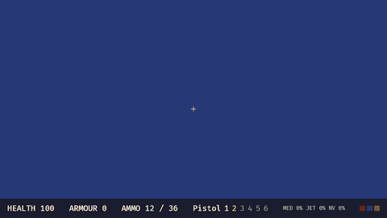

# Rex Ruckus: Meltdown

A fast, interactive, 90s-style 3D shooter inspired by the Build-engine classics.
Original code and content; CC0 assets credited in `CREDITS.md`.

▶ [Full-quality demo video (MP4)](docs/media/demo.mp4)

Run: `cargo run -p rr-game --release`
Test: `cargo test --workspace`

## Download (Windows)

Grab `rex-ruckus-<version>-windows-x64-setup.exe` from the
[latest release](https://github.com/DeepDiver1975/rex-ruckus/releases/latest). It installs the
game with a Start Menu entry and an uninstaller. Every pull request and push to `main` also
builds the installer; it is attached to the run of the *Windows installer* workflow as an
artifact.

## Building

Requires Rust 1.95+ (edition 2024). On Linux, Bevy also needs the ALSA and udev
development packages, e.g. on Debian/Ubuntu:

    sudo apt install libasound2-dev libudev-dev pkg-config

To build the Windows installer locally, install [Inno Setup 6](https://jrsoftware.org/isinfo.php),
then:

    cargo build -p rr-game --release
    iscc /DAppVersion=0.1.0 installer\rex-ruckus.iss

The installer is written to `installer\Output\`. Pushing a `v*` tag publishes it as a GitHub
release.

## License

GPL-3.0-or-later — see `LICENSE`.

## Controls

Click to capture the mouse (that first click does not fire) · Esc releases it · WASD move · Mouse look · Space jump · C / Left Ctrl crouch · E use (doors, lifts, switches) · LMB fire · R reload · F quick-kick · 1–6 or the mouse wheel switch weapons (1 boot, 2 pistol, 3 shotgun, 4 chaingun, 5 rocket launcher, 6 pipe bombs; with bombs out, a fresh fire press detonates them) · Q use the medkit · J toggle the jetpack (Space climbs, C / Left Ctrl descends) · N toggle night vision · M mute / unmute · `[` and `]` lower / raise the master volume by 10%

## Audio

Sound effects are a mix of synthesised sounds (recipes in `assets/sounds/synth.ron`, rendered to
`assets/sounds/synth/`) and curated CC0 recordings (`assets/sounds/cc0/`); `assets/sounds/bank.ron`
maps game events to them. Rex's voice quips are generated with Kokoro-82M (voice `am_onyx`,
`assets/quips/`) and shown as a subtitle on their own HUD line. Each level can
name a music track (`assets/music/`). Pass `--mute` to start silent; `--record` is always silent
and skips music. The outputs are committed, so you only regenerate them after changing a recipe
or a quip:

    cargo run -p rr-tools -- synth assets/sounds/synth.ron -o assets/sounds/synth
    scripts/gen-quips.sh                       # needs Python 3.10-3.12, sox, espeak-ng
    scripts/import-sfx.sh SRC DEST             # imports a CC0 recording (sox)

`import-sfx.sh` honours `LOOP="START LEN"`, `CHANNELS=2` and `NO_TRIM=1`; see the script header.
`rr-tools quips-list` prints the quip texts that `gen-quips.sh` voices.

## Pickups, death and level complete

Walk over items to collect them: ammo (bullets, shells, rockets, pipe bombs), the shotgun, chaingun, rocket launcher, health packs, atomic health (up to 200), armour, the medkit, the jetpack and night-vision goggles. Keycards work as before. When you die or finish the level, press Use or Fire to restart.

## Levels

The default level is `arsenal_depot.ron`, the M4a showcase: rockets and exploding barrels, glass, drones, a jetpack shaft and a secret behind a crack wall a pipe bomb opens. `combat_arena.ron`, `mechanics_lab.ron` and `test_yard.ron` can be passed as an argument (a file name in `assets/levels/`, or a path to a level file):

    cargo run -p rr-game --release -- test_yard.ron

Add `--mute` to start with the sound off (`M` toggles it in game).

## Tuning

Weapon and enemy stats live in `assets/defs/weapons.ron` and `assets/defs/enemies.ron`; edit them and restart.

## Level tools

    cargo run -p rr-tools -- validate assets/levels/*.ron
    cargo run -p rr-tools -- render-svg assets/levels/arsenal_depot.ron -o depot.svg

`validate` also checks that the sound bank covers every event, that quip files exist, that level music files exist and that every third-party audio file is listed in `CREDITS.md`.

In the SVG, glass panes are dashed cyan, crack walls hatched and secret sectors starred.

## Property tests

CI runs the property tests with a small case count. A nightly workflow (`.github/workflows/nightly.yml`, also runnable by hand) reruns them at `PROPTEST_CASES=20000`. Set the variable yourself to go deeper locally:

    PROPTEST_CASES=2000 cargo test -p rr-core --release --test movement_props

## Demo playback and recording

`--demo` replays a scripted run instead of reading the keyboard and mouse (a RON list of timed
input segments; see `assets/demo/arsenal_depot.ron`), and `--record DIR` saves every frame as a
PNG at a fixed 30 fps:

    cargo run -p rr-game --release -- arsenal_depot.ron --demo assets/demo/arsenal_depot.ron --record /tmp/frames

`scripts/record-demo.sh` does that and encodes `docs/media/demo.mp4` and `docs/media/demo.gif`
(needs a display and ffmpeg). Rerun it after visible changes to keep the README demo current.
